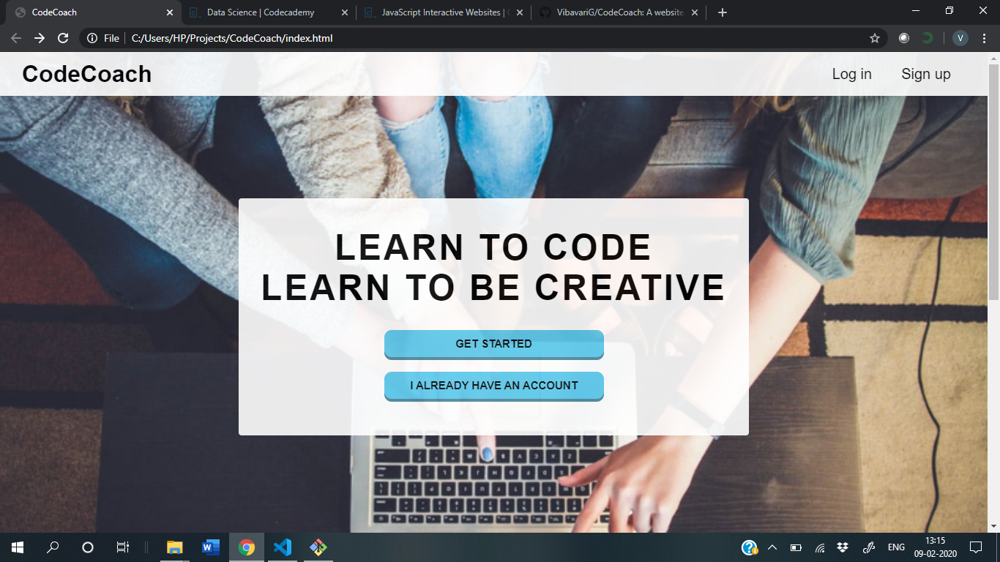
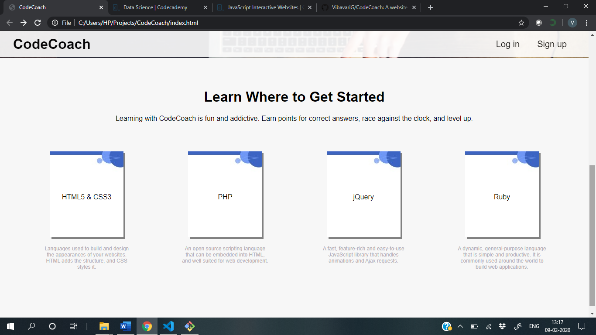
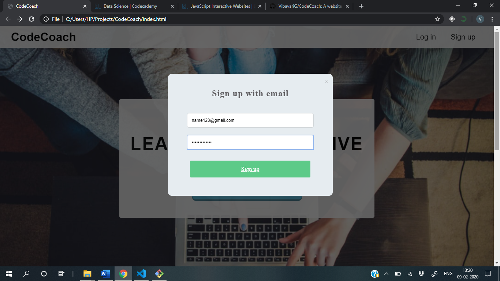
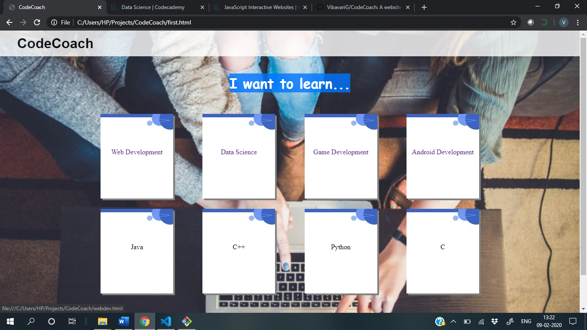
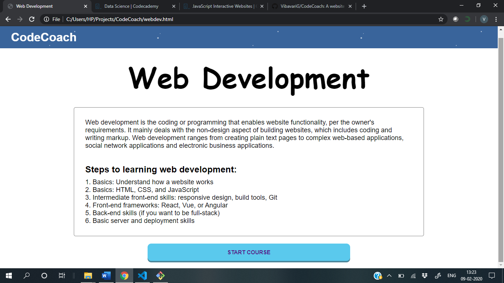
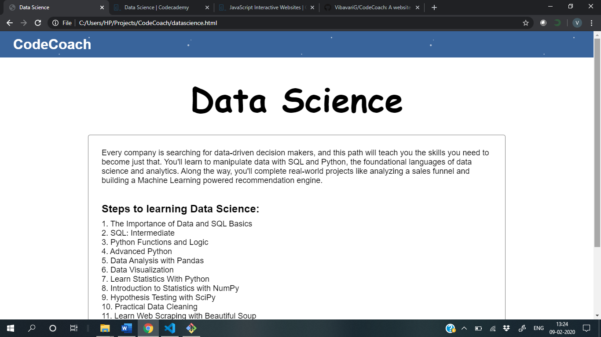
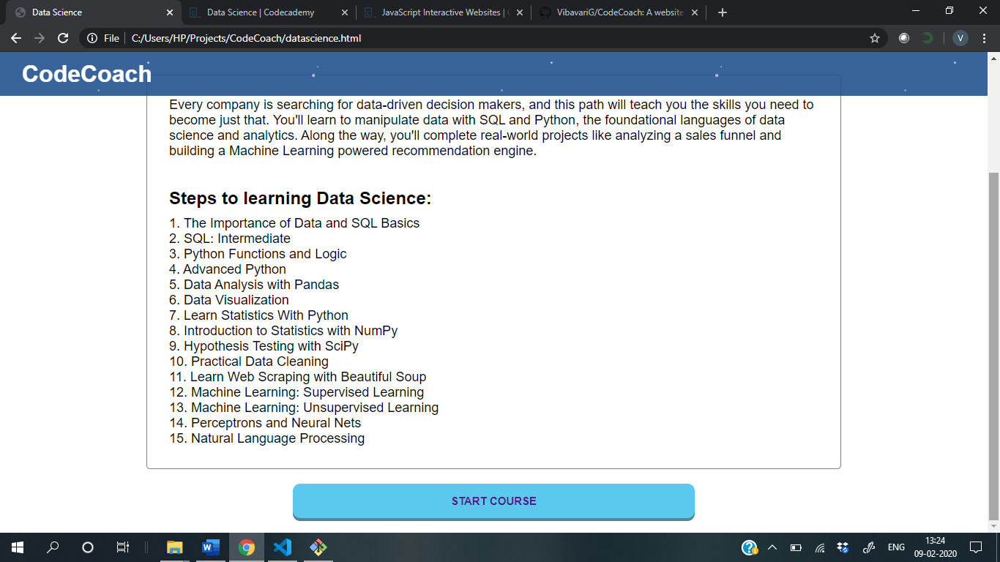
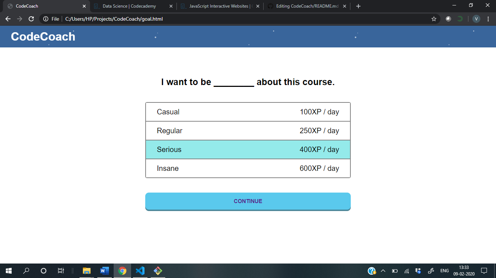

# CodeCoach
A website to help new coders learn coding

index.html is the main page from where you can login/signup.

It will take you to the first.html page which shows the user the different course options that we have. 

Selection of each option shows the description of that course and what is involved in it. 

If you want to stat the course, select how commited are you to the course and your daily goal, after which you'll be shown the course contents.

